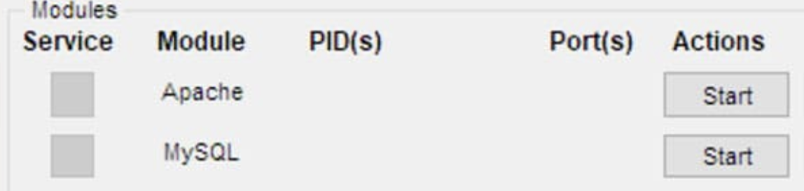
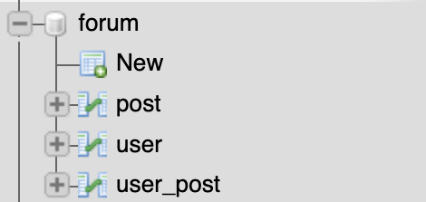

# Forum

- [REQUIREMENTS](#requirements)
- [INSTALLATION](#installation)
- [CONTRIBUTORS](#contributors)

## REQUIREMENTS

Suported operating Systems:
- **Windows** (Windows 2008, 2012, Vista, 7, 8, or later)
- **Linux** (Most all distributions of Linux are supported, including Debian, RedHat, CentOS, Ubuntu, Fedora, Gentoo, Arch, SUSE.)
- **OS X** (Mac OS X 10.6 or later)

To be able to test this Project you will also need the following program:
- [XAMPP (8.8.1)](https://www.apachefriends.org/de/index.html) includes:
    - [Apache (2.4.49)](https://httpd.apache.org/)
    - [PHP (8.8.1)](https://www.php.net/)
    - [MariaDB (10.4.21)](https://mariadb.org/)
    - [phpmyadmin](https://www.phpmyadmin.net/)

## INSTALLATION

1. At first you have to download and intall [XAMPP](https://www.apachefriends.org/de/download.html).

2. Open XAMPP and start the **Apache** and **MySQL** Mudule.

    

3. Open your Browser and navigate to [localhost](http://localhost). You should now see the **XAMPP Dashboard**.

4. Klick on **phpmyadmin** in the menu bar.
    
    

5. Create a new Database called **forum** with the collation: **utf8_general_ci**:

    

6. Import the provided Database [forum.sql](doc/forum.sql).

    

    You should now see the the database in your navigation tree including all tables.

    

7. Download this Project and place it into the *htdocs* folder of **XAMPP**.
        
        C:\xampp\htdocs

8. You should now be able to access the Forum at [localhost/forum](http://localhost/forum).

9. You can now delete the folder [doc](doc/) and the file [README.md](README.md).

10. For the improved version just repeat steps \[5-6\] but instead call the database **forumsec** and import the improved Database [forumsec.sql](doc/forumsec.sql).
Safe the server files of the improved branch in the *htdocs/forumsec* instead of *htdocs/forum* foder.

Passwords for testing purposes:

username      | forum password | forumsec password
------------- | -------------- | -------------
noahjauchmann | 123456789      | ,C2eSBiZLjNx4D
jasminkufner  | password       | kYMGDB,5:jQ"MQ
lisahüttinger | qwertz         | 7&bJSI3_zWk6kb
regularuser   | abcdefg        | vS!R)_IPHiBsZ1

## CONTRIBUTORS

[Jasmin Kufner](https://mygit.th-deg.de/jk05234)

[Lisa Hüttinger](https://mygit.th-deg.de/lh12318)

[Noah Jauchmann](https://mygit.th-deg.de/nj16016)
